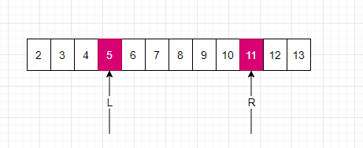
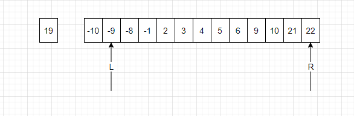
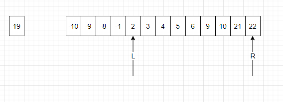
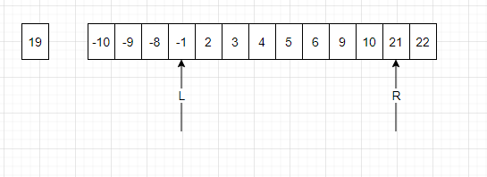
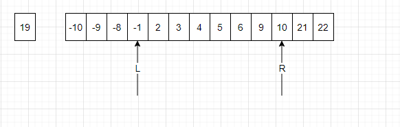

# 双指针解法浅析

### 双指针的解法思路可以直接看乐扣的官方答案, 但是我看完答案后, 不太理解,为什么比target小, 只需要移动right指针, 而不需要移动left指针? 如下图所示
> 当 `L+R<Target` 为什么要`左移R`, 而不是`左移L`?

> 如果只是`左移R`, 有没有可能错过了某些数字导致错过了答案?

### 首先我们先按照题目构造一下数组
> 题目假设 `每个输入 只对应唯一的答案`, 假设我们的target是`19`, 我们只保留`9,10`, 删除`8,11`,`7,12`,`6,13`, 然后我们加一些很大的数字和负数防止R不移动

### 接下来, 由于 `-10 + 22 = 12 < 19`, 此时只能`L右移`

### 接下来, `-9 + 22 = 13 < 19`, 由于R右边没数组了, 因此L继续右移一直到 `-1`

### 接下来, `-1 + 22 = 21 > 19`, 此时有两个选择 `L左移` `R左移`, 此时按照算法, 应该`R左移`, 但是为什么不`L左移`？
> 此时对于-8 来说, 右边最大的数都不能得到19, 因此此时需要执行R左移

### 接下来 `-1 + 21 = 20 > 19`, 按照上面的原因, 应该执行`R左移`

### 接下来 `-1 + 10 = 9 < 19`

#TODO 还是不太懂双指针是怎么规避这个问题的, 等后面有思路了再补充

