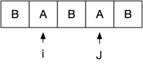

## 1. dp数组定义
```text
dp[i][j] 代表s[i:j]是否是回文字符串
```
## 2. 状态转移方程, 如何从dp[i][j] 推导出下一个dp值?
### 假如此时状态是这样的, 那么应该是往中间合拢还是往外边扩散?

### 理论上都可以才对, 往中间靠拢需要递归, 往外边扩散则需要迭代，以外边扩散为例
```text
我需要根据dp[i+1][j-1] 找到dp[i][j](先不管此时dp[i+1][j-1]咋算出来的)

dp[i+1][j-1] ==> dp[i][j]

如果 dp[i+1][j-1] 是false, 那么dp[i][j] 不会是true, 因为一个回文串的子串肯定也是回文串吧

如果dp[i+1][j-1]是ture的话, 那么如果s[i] == s[j] 则dp[i][j]也是ture, 否则就是false

那么此时伪代码可以这样写
//首先全部初始化为false
getDpIJ(dp [][]int, i, j int) {
    if dp[i+1][j-1] == true {
        if s[i] == s[j] {
            dp[i][j] == true
        }
    } else {
        //由于我们初始化成了false, 则默认就是false 
    }
}
```
## 3. dp数组如何初始化?
```text
当dp[i][j]中i==j的时候, 只有一个字符肯定是true
```

## 4. dp数组遍历顺序

```text
注意我们的获取顺序,  dp[i+1][j-1] ==> dp[i][j]
并且由于这个数组是上线对称的因此只需要计算右上区域即可
那么我们可以先获取到途中红色的数据
```

```text
那么蓝色的区域怎么办? 如果计算出蓝色部分的话, 那么右上角的白色部分也能通过 dp[i+1][j-1] ==> dp[i][j] 的方式获取到了
那么就以这个图中的 △ 为例dp[0][1], 来分析
首先,dp[0][1]代表s[0:1]是不是回文字符串, 那么 BA 这个字符串明显不是回文的, 我们的判断依据就是 B != A,那么此时 dp[0][1] = false
同理: 
    dp[1][2] => s[1:2] = AB,  dp[1][2] = false
    dp[2][3] => s[2:3] = AA,  dp[2][3] = true
    dp[3][4] => s[3:4] = AB,  dp[3][4] = false

此时就需要修改动态转移伪代码了:
getDpIJ(dp [][]int, i, j int) {
    if j - i == 1 {
        if s[i] == s[j] {
            dp[i][j] == true
        }     
    }

    if dp[i+1][j-1] == true {
        if s[i] == s[j] {
            dp[i][j] == true
        }
    } else {
        //由于我们初始化成了false, 则默认就是false 
    }
}
```

```text
此时, 理论上我们可以计算出所有的右上的节点, 但是需要考虑一下遍历顺序
能不能按照下图一的横向遍历?

可以发现当遍历到下面第二张图蓝色的节点(dp[0][4])的时候, 首先按照我们的逻辑, 需要走 `if dp[i+1][j-1] == true {`  这一步, 但是我们dp[i+1][j-1] 其实都还没算出来, 那么得到的dp[i][j]肯定是错误的

此时我们也可以斜着遍历, 先把淡蓝色的节点先算出来, 然后再计算其他的, 但是这样听起来好麻烦
```


```text
我们可以从下往上遍历一波,此时就不会出现上面说的问题了
因此如下:


func longestPalindromeDp(s string) string {
	//dp[i][j] 代表s[i:j] 是否为回文串
	dp := make([][]int, len(s))
	for i := 0; i < len(dp); i++ {
		t := make([]int, len(s))
		dp[i] = t
	}

	//对于i == j 则代表只有一个字符 肯定是回文串
	for i := 0; i < len(dp); i++ {
		for j := 0; j < len(dp[i]); j++ {
			if i == j {
				dp[i][j] = 1
			}
		}
	}

	left := 0
	right := 0
	max := 0
	for i := len(s) - 1; i >= 0; i-- {
		for j := i; j < len(s); j++ {
			//这里不太好遍历下图的路线
			//就按对角线遍历, 然后相等continue
			if i == j {
				continue
			}
			
			if j-i <= 1 {
				if s[i] == s[j] {
					dp[i][j] = 1
				} else {
					//此处已经计算出对应的值了, 不应该在走获取左下数值的操作
					continue
				}
			}

			if dp[i+1][j-1] == 1 {
				if s[i] == s[j] {
					dp[i][j] = 1
				}
			}

			//这里更新最大值
			if dp[i][j] == 1 && j-i+1 > max {
				max = j - i + 1
				left = i
				right = j
			}
		}
	}

	for _, v := range dp {
		fmt.Println(v)
	}

	fmt.Println()

	return s[left : right+1]
}

```
