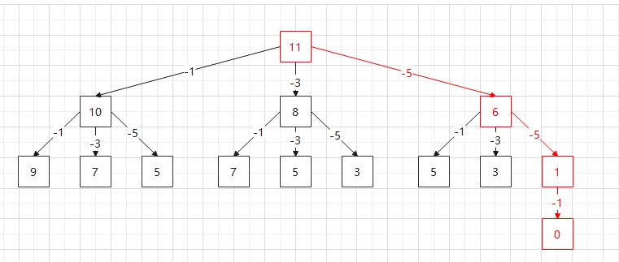

# 凑硬币问题自己的思路

## 看他们的动态规划实在是看不懂, 什么状态转移方程头晕眼花, 我记录下自己的思路

### 首先以[1,3,5] 11 为例, 如下所示


#### 总金额是11块, 然后每次减掉coins中的面额(-1,-3,-5) 这样就得到了一个三叉树, 从图中可以看到红色的是最优解(其他的画不下就没画了)


### 这样, 问题就变为了构建这样的一颗三叉树, 求叶子节点为0的所有子树的最小深度, 代码如下

```go
package main

import (
	"fmt"
	"math"
)

//单单以[1,3,5]为例, 每个节点有三条链
type coinsNode struct {
	Val   int
	One   *coinsNode
	Three *coinsNode
	Five  *coinsNode
}

// CreateNode 递归创建子树
func CreateNode(amount int, coins []int) *coinsNode {
	if amount < 0 {
		return nil
	}
	root := &coinsNode{Val: amount}
	root.One = CreateNode(amount-coins[0], coins)
	root.Three = CreateNode(amount-coins[1], coins)
	root.Five = CreateNode(amount-coins[2], coins)
	return root
}

func myCoin(coins []int, amount int) *coinsNode {
	root := &coinsNode{Val: amount}

	root.One = CreateNode(amount-coins[0], coins)
	root.Three = CreateNode(amount-coins[1], coins)
	root.Five = CreateNode(amount-coins[2], coins)
	return root
}

//递归计算树的深度
func traversal(root *coinsNode, depth *int, min *int) {
	if root == nil {
		return
	}

	*depth++
	if root.One == nil && root.Three == nil && root.Five == nil {
		if root.Val == 0 && *min > *depth {
			*min = *depth
		}
	}

	traversal(root.One, depth, min)
	traversal(root.Three, depth, min)
	traversal(root.Five, depth, min)
	*depth--
}

func Calc(root *coinsNode) int {
	depth := 0
	min := math.MaxInt64
	traversal(root, &depth, &min)
	if min == math.MaxInt64 {
		return -1
	}

	return min - 1
}

func main() {
	root := myCoin([]int{1, 3, 5}, 11)
	fmt.Println(Calc(root))
}
```

### 此时问题来了, 我coins里面不是3个数字怎么办?
#### 我们修改一下结构体, 用一个数组维护一下, 代码如下
```go
package main

import (
	"fmt"
	"math"
)

type nCoinsNode struct {
	Val   int
	Nodes []*nCoinsNode
}

// CreateNodes 生成N叉树
func CreateNodes(coins []int, amount int) *nCoinsNode {
	if amount < 0 {
		return nil
	}

	root := &nCoinsNode{Val: amount}

	for i := 0; i < len(coins); i++ {
		node := CreateNodes(coins, amount-coins[i])
		if node == nil {
			continue
		}
		root.Nodes = append(root.Nodes, node)
	}

	return root
}

func traversalN(root *nCoinsNode, depth *int, min *int) {
	if root == nil {
		return
	}

	*depth++

	//如果是叶子节点(子节点的个数为0), 且值为0,则说明符合条件的链条
	if len(root.Nodes) == 0 && root.Val == 0 && *min > *depth {
		*min = *depth
	}

	for i := 0; i < len(root.Nodes); i++ {
		traversalN(root.Nodes[i], depth, min)
	}
	
	*depth--
}

func CalcN(root *nCoinsNode) int {
	depth := 0
	min := math.MaxInt64
	traversalN(root, &depth, &min)
	if min == math.MaxInt64 {
		return -1
	}

	return min - 1
}

func coinChange(coins []int, amount int) int {
	root := CreateNodes(coins, amount)
	return CalcN(root)
}

func main() {
	fmt.Println(coinChange([]int{1,3,5},11))
}

```
### 此时问题来了, 当用例跑到[1,2,5], 100 的时候,时间复杂度太高了, 电脑差点儿死机了..., 后来发现瓶颈在于`创建链表的时间太长了`

### 如果不创建N叉树, 那么该如何遍历?
#### 此时就要转变思路了, 不使用链表, 如何遍历这颗N叉树?

```
func traversal(coins []int, depth *int, min *int, amount int) {
	if amount < 0 {
		return
	}

	*depth++

	for i := 0; i < len(coins); i++ {

		if amount-coins[i] == 0 && *min > *depth {
			*min = *depth
		}
		traversal(coins, depth, min, amount-coins[i])
	}
	*depth--
}

func coinChange(coins []int, amount int) int {
	depth := 0
	min := math.MaxInt64

	traversal(coins, &depth, &min, amount)

	if min == math.MaxInt64 {
		return -1
	}

	return min
}
```
### 此时效果好了不少, 但是当 i = 50左右, 就算不动了, 需要剪剪枝